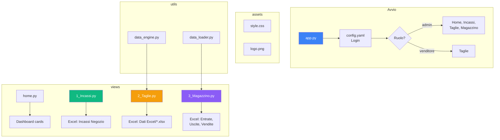
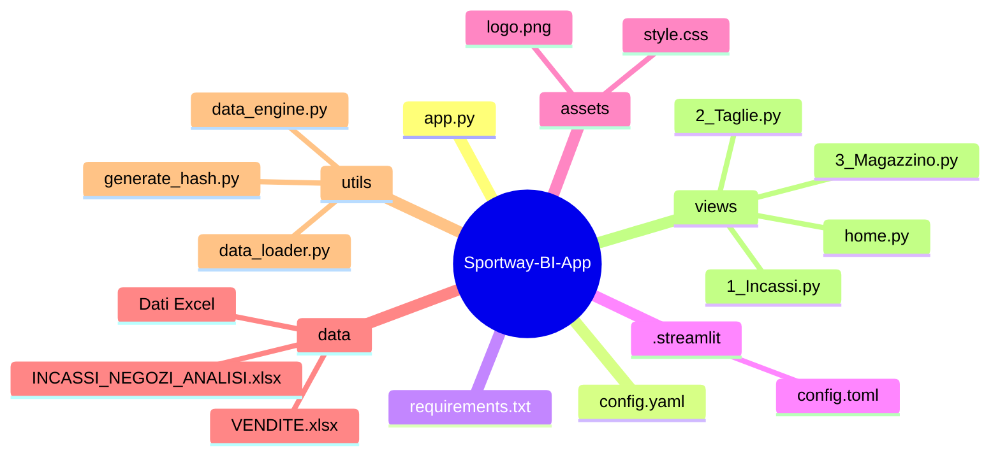

# Sportway BI

Piattaforma di Business Intelligence per l'analisi delle performance dei negozi Sportway.

## Architettura del progetto





## Requisiti

- Python 3.11+
- Dipendenze in `requirements.txt`

## Installazione

```bash
pip install -r requirements.txt
```

## Avvio

```bash
streamlit run app.py
```

## Dati

I file Excel nella cartella `data/` contengono i dati di vendita, incassi e magazzino.

## Autenticazione

Due ruoli disponibili in `config.yaml`:
- **admin** — accesso a tutte le dashboard
- **venditore** — accesso solo alla dashboard Taglie
